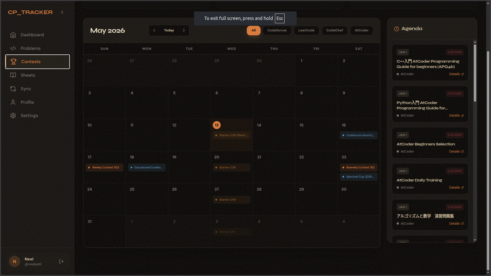
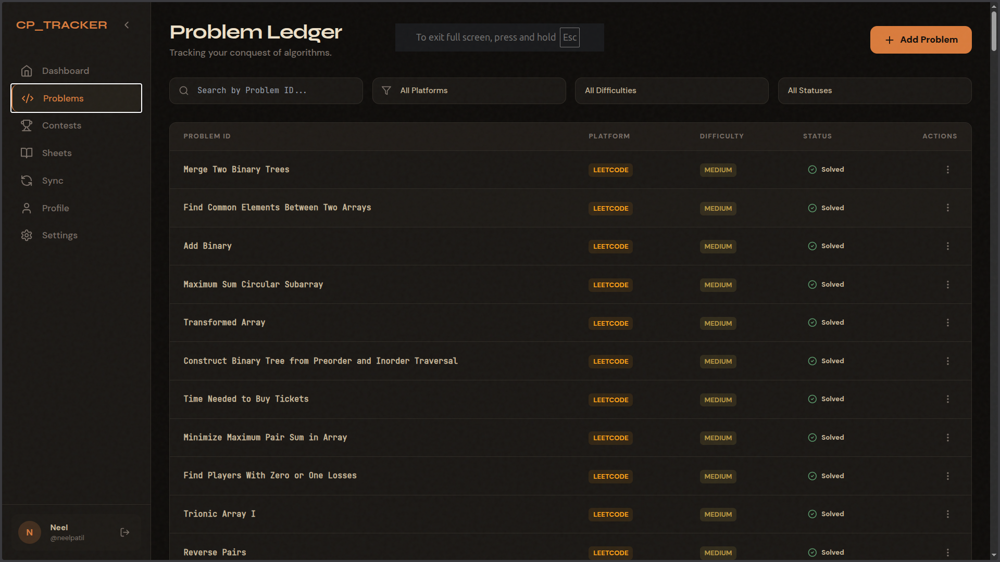

# CodePulse

> A full-stack competitive programming dashboard — track progress, sync submissions, and monitor contests across LeetCode, Codeforces, CodeChef, and AtCoder.

<!-- 

 -->


---

## The Problem

Competitive programmers solve problems across 4–5 platforms, track ratings in separate tabs, and miss contests because there's no unified view. DSA Tracker consolidates everything into one dashboard.

---

## Features

| Area | What it does |
|---|---|
| **Dashboard** | Total solved, difficulty breakdown, rating trends, activity heatmap |
| **Problem Tracker** | Log problems manually with status, difficulty, platform, and notes |
| **Platform Sync** | Pull accepted submissions, streaks, and rating history from LeetCode & Codeforces |
| **Contest Calendar** | Aggregates upcoming contests from all 4 platforms with countdowns |
| **Profile** | Manage handles, college info, visibility settings |
| **Auth** | JWT + refresh tokens, CSRF protection, role-based routes |

---

## Tech Stack

**Frontend** — Next.js 14, React, TypeScript, Tailwind CSS, Recharts, Axios

**Backend** — Node.js, Express.js, MongoDB, Mongoose, JWT, bcrypt

---

## Project Structure

```
DSA_Tracker/
├── Backend/
│   ├── src/
│   │   ├── config/          # DB connection
│   │   ├── controllers/     # Route handlers (auth, dashboard, progress, sync, contests)
│   │   ├── middleware/      # JWT auth, CSRF
│   │   ├── models/          # User, Progress schemas
│   │   ├── routes/          # API route definitions
│   │   └── services/        # LeetCode GraphQL, Codeforces API, contest aggregator
│   ├── app.js
│   └── server.js
│
└── Frontend/
    └── src/
        ├── app/
        │   ├── (auth)/      # Login, Register pages
        │   └── (dashboard)/ # Dashboard, Problems, Contests, Profile, Sync, Sheets
        ├── components/      # Layout, dashboard widgets, problem & contest cards
        ├── context/         # AuthContext, ToastContext
        ├── hooks/           # useContests
        └── lib/             # Axios instance, utilities
```

---

## Getting Started

### Prerequisites

- Node.js ≥ 18
- MongoDB URI (Atlas or local)
- LeetCode username / Codeforces handle (for sync)

### 1. Clone

```bash
git clone https://github.com/Neel092/DSA_Tracker
cd DSA_Tracker
```

### 2. Backend

```bash
cd Backend
npm install
```

Create `.env`:

```env
PORT=5000
MONGODB_URI=your_mongodb_uri
JWT_SECRET=your_jwt_secret
JWT_REFRESH_SECRET=your_refresh_secret
NODE_ENV=development
FRONTEND_URL=http://localhost:3000
```

```bash
npm run dev
```

### 3. Frontend

```bash
cd Frontend
npm install
```

Create `.env.local`:

```env
NEXT_PUBLIC_API_URL=http://localhost:5000
```

```bash
npm run dev
```

Open [http://localhost:3000](http://localhost:3000).

---

## API Reference

### Auth
```
POST   /api/auth/register
POST   /api/auth/login
POST   /api/auth/logout
POST   /api/auth/refresh-token
GET    /api/auth/profile
GET    /api/auth/csrf-token
PUT    /api/auth/update-profile
```

### Progress
```
GET    /api/progress
POST   /api/progress
PUT    /api/progress/:id
DELETE /api/progress/:id
```

### Sync
```
POST   /api/sync/leetcode
POST   /api/sync/codeforces
```

### Contests
```
GET    /api/contests/upcoming
```

---

## Architecture

```
Next.js Frontend
      ↓ Axios
Express REST API
      ↓
Controllers → Services
      ↓
MongoDB ←→ External APIs
           (LeetCode GraphQL · Codeforces · CodeChef · AtCoder)
```

**Sync flow:** user triggers sync → `sync.controller.js` → platform service → normalize → upsert MongoDB → return stats

**Contest flow:** `contest.controller.js` → `contestAggregator.service.js` fetches all 4 platforms in parallel → normalize → merge & sort → response

---

## Roadmap

- [ ] CodeChef, GeeksforGeeks, HackerRank sync
- [ ] Redis caching
- [ ] Background job queues (webhook-based sync)
- [ ] Leaderboard
- [ ] Sheet generator & Interview tracker
- [ ] Company-specific problem roadmaps
- [ ] Docker + CI/CD pipeline

---

## Author

**Neel Patil** — CS Engineering Student 

[](https://github.com/Neel092)

---
